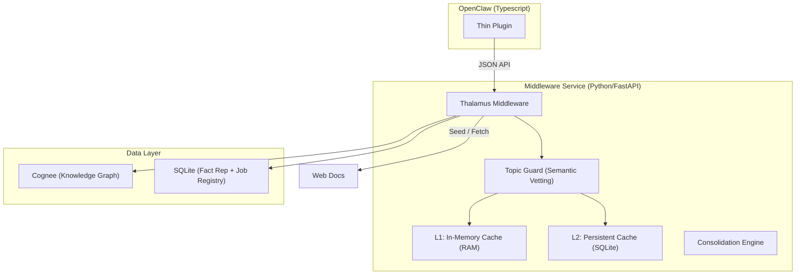
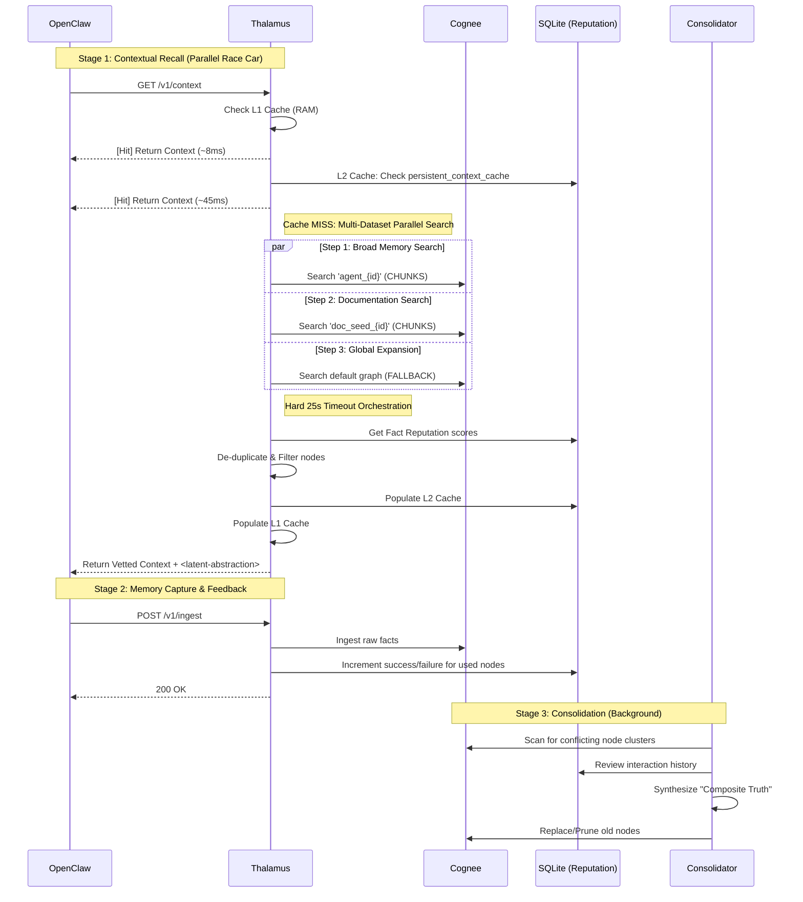

# TADD: OpenClaw + Cognee "Universal Middleware" Architecture

## 1. Overview
This document outlines the migration from a **hardcoded built-in** Cognee integration to a **modular, middleware-first** approach. The goal is to move the core intelligence (graph reasoning, caching, and cleaning) into a standalone Python service, leaving the OpenClaw integration as a stable, lightweight bridge.

---

## 2. System Architecture
Thalamus acts as the "Cognitive Traffic Controller" and **Evolutionary Knowledge Hub** between OpenClaw and Cognee.

### 📡 Event Pipeline
Thalamus notifies external services via webhooks when data is processed:
-   **MEMORIES_PUSHED**: Fired when new message turns are ingested via `/v1/ingest`.
-   **MEMORIES_SYNCED**: Fired when session logs are crawled via `/v1/sync`.

### 🧠 Evolutionary Knowledge (SQLite)
Thalamus uses a local SQLite database to manage the **lifecycle** of facts stored in Cognee.
-   **Fact Reputation**: Every interaction weights the "confidence" of a graph node. High-failure nodes are eventually "hidden" from the agent.
-   **Temporal Decay**: Passive "forgetting" of stale information that hasn't been accessed or reinforced in recent interaction cycles.

---

## 3. Sequence: Evolutionary Data Flow

---

## 4. Implementation Details

### A. Fact Consolidation
-   **Synthesis**: Periodic passes merge redundant or conflicting nodes into high-confidence "wisdom" nodes using the agent's historical performance as a guide.
-   **Conflict Resolution**: Empirical truth (terminal success) always out-ranks seeded documentation when conflicts arise in SQLite.

### B. Output Sanitization & Freshness
-   **Tag Stripping**: Prevents prompt injection breakouts.
-   **Freshness Weighting**: Natural decay ensures that older, un-reinforced knowledge drifts into "Historical Cold Storage."

---

## 5. Dynamic Scaling & Mitigations
Thalamus is designed to handle high-volume streams by implementing proactive mitigations:
- **Penalty-based Decay**: Nodes that cause agent failures receive a "Penalty" to their `dynamic_threshold`. This makes them increasingly likely to be filtered out of future context until they are either "Reset" (by success) or Archived.
- **Queue Buffering**: Memory ingestion and seeding tasks are processed via an asynchronous `asyncio.Queue` with a configurable `maxsize` to prevent memory exhaustion during bulk operations.

## 6. LLM Provider Orchestration
The synthesis engine handles LLM provider availability through a "Lazy-Pull" mechanism:
- **Auto-Pull**: If the configured Ollama model (e.g., `qwen3.5:9b`) is missing from the LAN provider, Thalamus automatically triggers a pull before continuing the synthesis pass.
- **Robust Joining**: Provider URLs are handled robustly to ensure compatibility with various endpoint configurations (e.g., trailing slashes).
