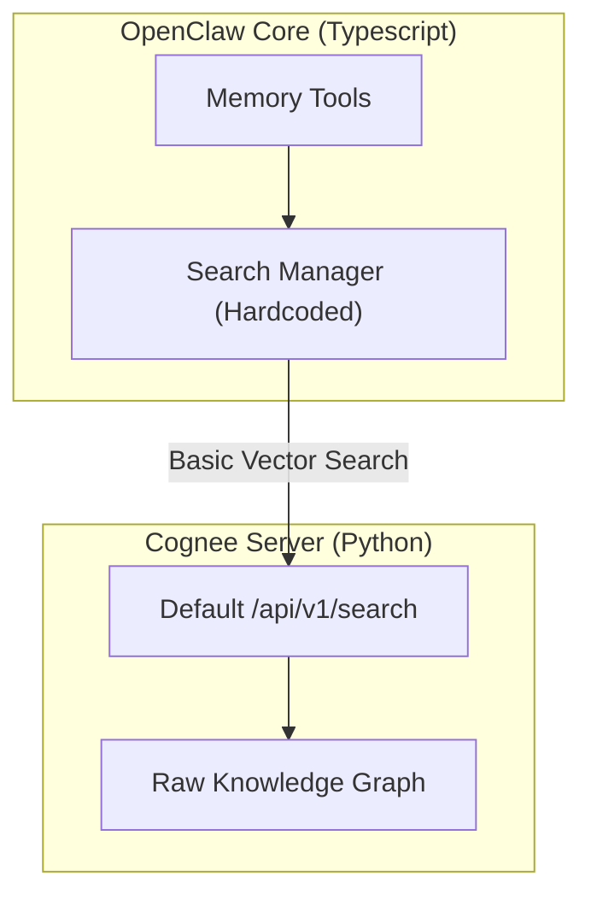
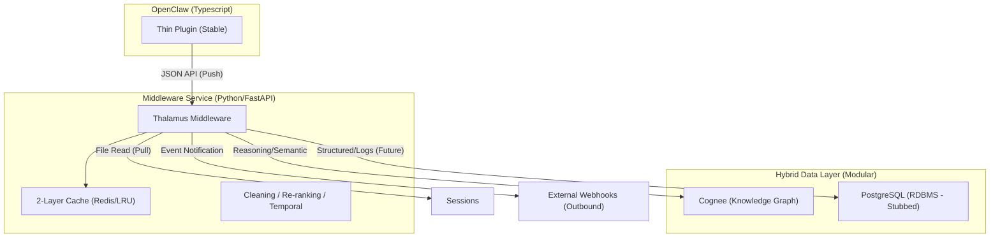
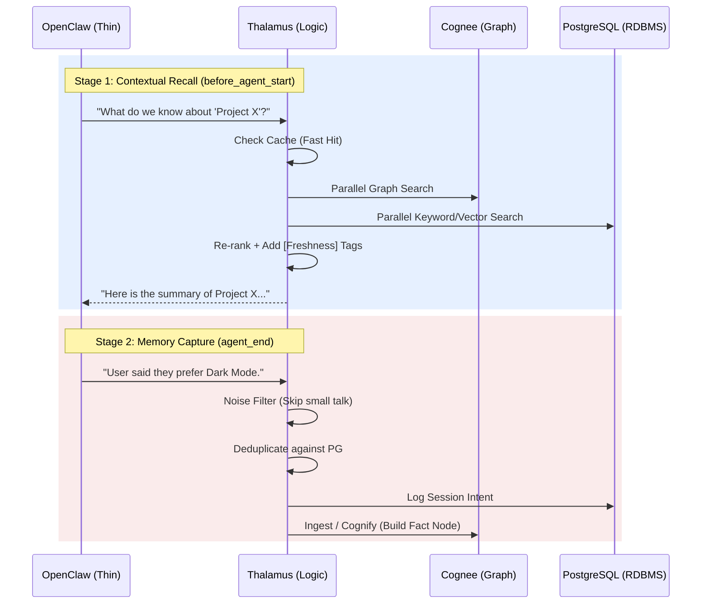

# TADD: OpenClaw + Cognee "Universal Middleware" Architecture

## 1. Overview
This document outlines the migration from a **hardcoded built-in** Cognee integration to a **modular, middleware-first** approach. The goal is to move the core intelligence (graph reasoning, caching, and cleaning) into a standalone Python service, leaving the OpenClaw integration as a stable, lightweight bridge.

---

## 2. Current State (Built-in Integration)
Currently, Cognee is integrated directly into the OpenClaw core. This is difficult to maintain and lacks advanced features like caching or hybrid search.

---

## 3. Proposed State (The Universal Vision)
The new vision introduces a **Standalone Middleware** (Thalamus) that acts as a "Traffic Controller" and a **Hybrid Data Layer**.

### 📡 The "Event-Driven" Webhook Layer
Thalamus is no longer a passive relay; it proactively notifies the ecosystem when internal state changes.
-   **MEMORIES_SYNCED**: Fired when a session `sync` or `ingest` is complete.
-   **FACT_EXTRACTED**: Fired when a high-importance fact (user preference) is discovered.
-   **GRAPH_UPDATED**: Fired when Cognee finishes its background reorganization.

### 🧠 The "Pull-based Sync" (Middleware-Led Intelligence)
Instead of relying on OpenClaw to decide what is "important," Thalamus can now **pull** raw session data directly from OpenClaw's filesystem.
-   **Why**: OpenClaw's native memory filters are often too aggressive or too noisy. Thalamus can use more expensive, intelligent models to "mine" facts from raw logs in the background.
-   **How**: Thalamus monitors the `.jsonl` session files, extracts atomic facts, and "cognifies" them into a coherent graph.

### Why this architecture?
1.  **Total Decoupling**: Changes to Cognee's internal API never break the OpenClaw plugin.
2.  **Hybrid Power**: Combines Cognee's graph reasoning with high-speed Metadata filtering.
3.  **Stability**: The OpenClaw plugin becomes a tiny, unchanging bridge.

---

## 4. Sequence: Middleware Data Flow

---

## 5. Memory Management Strategies

### A. Advanced Search & Optimization
-   **Hybrid Parallel Search**: Concurrent Vector, Keyword, and Graph queries.
-   **2-Layer Caching**: Prompt-level and Embedding-level caching.

### B. Memory Sanitization (The "Gardener")
-   **Duplicate Detection**: High-threshold similarity check prevents redundant nodes.
-   **Noise Filtering**: LLM-based classification drops "small talk".
-   **Conflict Resolution**: Detects when new info overwrites old info.

### C. Governance & Temporal Encoding
-   **Freshness Markers**: Context is tagged with `[Current]`, `[Stale]`, or `[Historical]`.
-   **Importance Weighting**: High-signal facts are prioritized.
-   **Privacy Redaction**: Automated scrubbing of API keys and PII.
-   **Provenance**: Every memory traces back to its original session.
