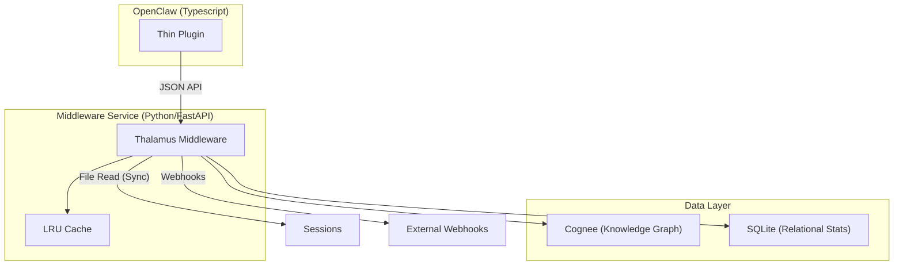
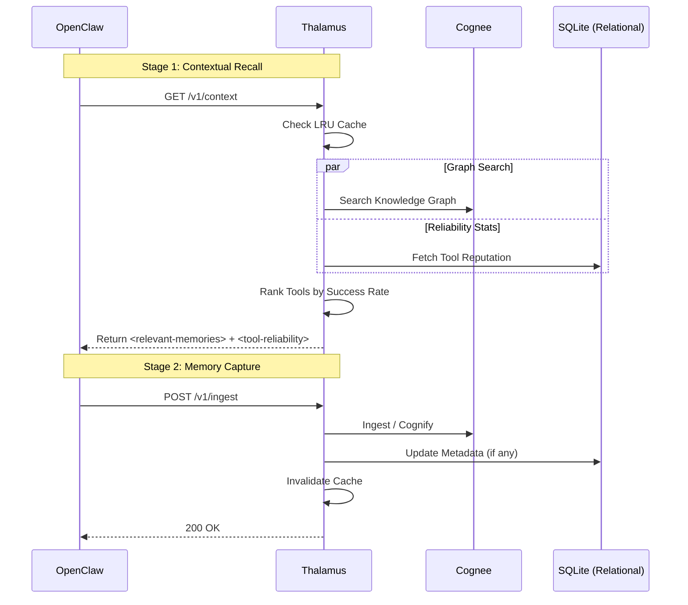

# TADD: OpenClaw + Cognee "Universal Middleware" Architecture

## 1. Overview
This document outlines the migration from a **hardcoded built-in** Cognee integration to a **modular, middleware-first** approach. The goal is to move the core intelligence (graph reasoning, caching, and cleaning) into a standalone Python service, leaving the OpenClaw integration as a stable, lightweight bridge.

---

## 2. System Architecture
Thalamus acts as the "Cognitive Traffic Controller" between OpenClaw and Cognee.

### 📡 Event Pipeline
Thalamus notifies external services via webhooks when data is processed:
-   **MEMORIES_PUSHED**: Fired when message turns are ingested via `/v1/ingest`.
-   **MEMORIES_SYNCED**: Fired when session logs are crawled via `/v1/sync`.

### 🧠 Performance & Reliability (SQLite)
Thalamus uses a local SQLite database for cross-agent metadata and performance tracking.
-   **Tool Reliability Ranking**: Every tool execution success or failure is recorded. The system ranks tools by success rate and briefs the agent on which tools are currently most reliable via the `<tool-reliability>` context block.
-   **Context Caching**: A TTL-based LRU cache prevents redundant graph searches, reducing latency for frequent queries.

### 🧠 Session Synchronization
Thalamus can **pull** raw session data directly from OpenClaw's filesystem.
-   **How**: The `/v1/sync` endpoint reads `.jsonl` session files from the OpenClaw data directory and ingests them into the Cognee graph.
-   **Benefit**: Allows for rebuilding or expanding the knowledge graph from historical data without relying on real-time capture.

### Why this architecture?
1.  **Isolation**: Changes to Cognee's internal API are handled within the middleware.
2.  **Performance**: The LRU cache provides high-speed recall for repeated queries.
3.  **Observability**: Webhooks and tool stats provide visibility into memory performance.

---

## 3. Sequence: Data Flow

---

## 4. Implementation Details

### A. Context Caching
-   **LRU Cache**: A simple time-to-live (TTL) cache prevents redundant graph searches for the same query during a session.
-   **Invalidation**: Ingesting new memories automatically clears the cache for the relevant agent to ensure freshness.

### B. Output Sanitization
-   **Tag Stripping**: To prevent prompt injection, Thalamus strips any nested `<relevant-memories>` or `<external-content>` tags from the memories before returning them to OpenClaw.

### C. Reliability Tracking
-   **Tool Stats**: Records tool execution events in a local SQLite database to track reliability over time.
