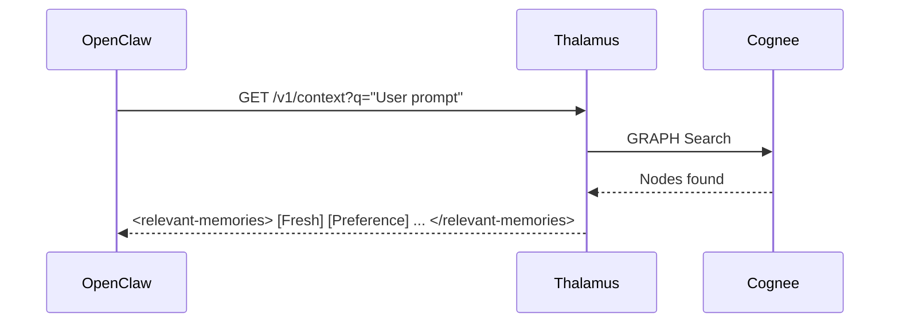
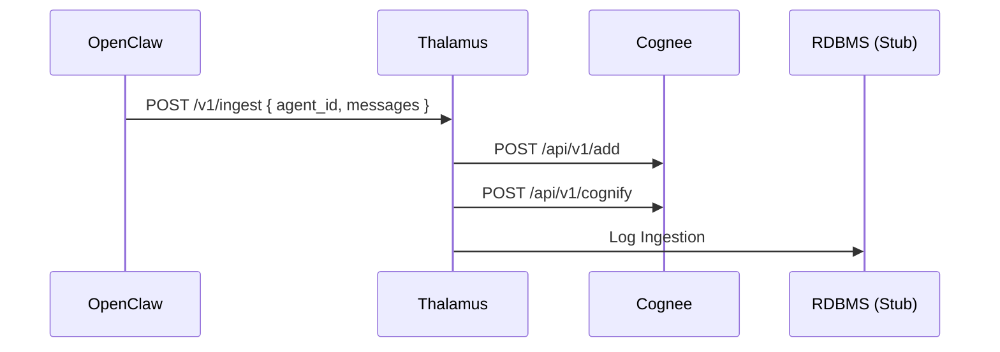

# Implementation Walkthrough: Thalamus Memory System

I've successfully implemented a state-of-the-art long-term memory system called **Thalamus**. It bridges the **OpenClaw (TypeScript)** ecosystem with the **Cognee (Python/Graph)** engine via a decoupled middleware.

## 🏗️ The Architecture
We moved away from a hardcoded integration to a "Thin Plugin + Intelligent Middleware" model.

### 1. Thalamus Middleware (Python/FastAPI)
Acts as the "Brain's Relay Station."
- **Location**: `/Users/clawdius/Projects/thalamus/`
- **Key File**: `src/thalamus/main.py`
- **Features**:
    - **Context Generation**: `/v1/context` fetches graph nodes from Cognee and formats them for the agent.
    - **Injest/Cognify**: `/v1/ingest` automatically stores and processes (cognifies) new memories.
    - **Hybrid Stubbing**: Uses a `StorageProvider` interface with a `CogneeProvider` and a `StubRelationalProvider`.

### 2. Thalamus OpenClaw Plugin (TypeScript)
Acts as the "Thin Client Bridge."
- **Location**: `/Users/clawdius/Projects/openclaw/extensions/thalamus/`
- **Key File**: `index.ts`
- **Hooks**:
    - **Auto-Recall**: Fetches context from Thalamus *before* the agent starts.
    - **Auto-Capture**: Sends conversation turns to Thalamus *after* the agent ends.

---

## ⚡ How it works in practice

### A. Automatic Memory Injection
When a user sends a prompt, the plugin calls Thalamus:

### B. Proactive Memory Capture
After the conversation turn ends:

